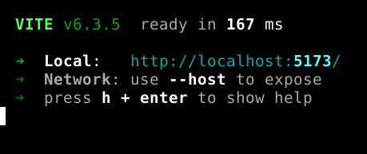
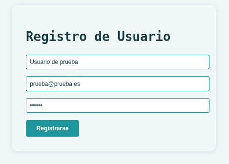
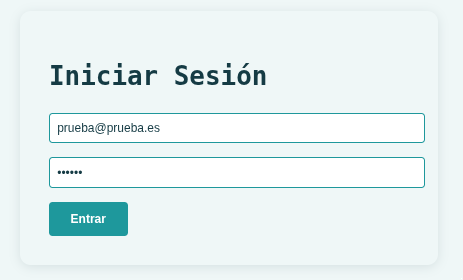
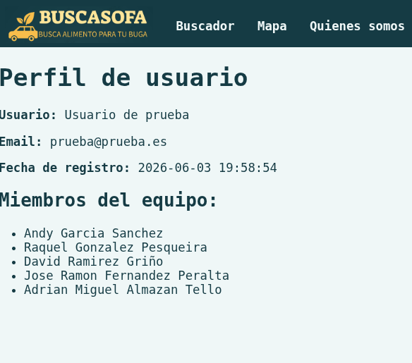
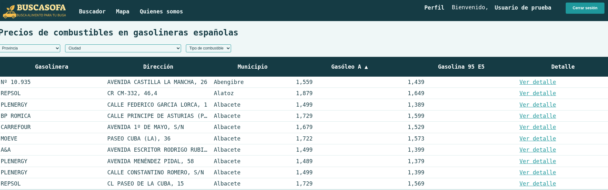
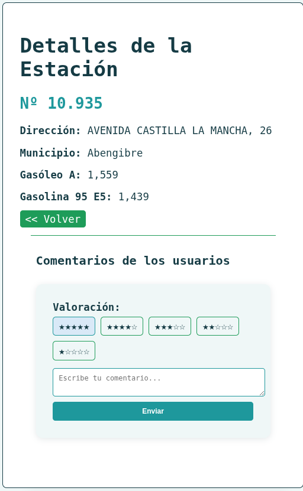
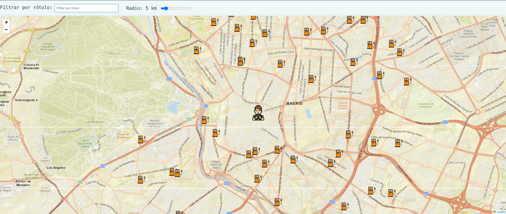
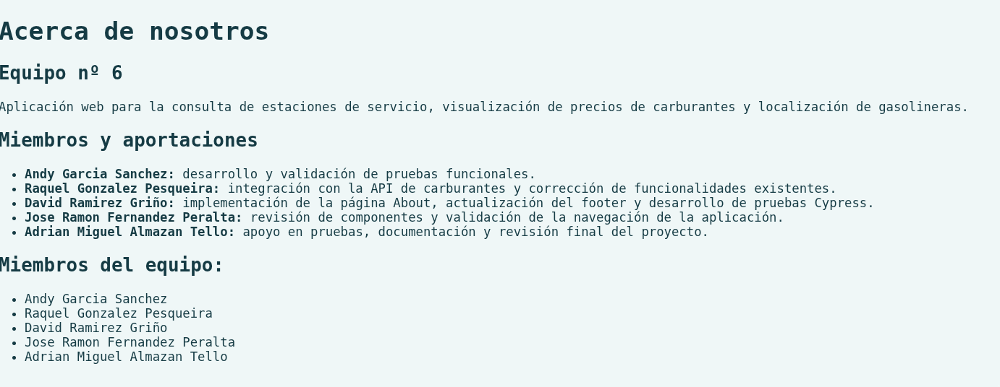

</br>
<p align="center" style="font-size:24px;font-weight:bold;">BUSCASOFA</p>
</br>

# Instalación

## Servidor

<div style="border:2px solid orange;padding: 10px;text-align:justify;"> Para realizar la instalación de <strong>buscasofa</strong> y <strong>buscasofa-server</strong> es necesario tener instalado node.JS en tu sistema.</div>

### Descarga

Para descargar la aplicación **buscasofa-server** desde  GitHub, se debe utilizar una consola de comandos y ejecutar la siguiente instrucción:

```git clone https://github.com/raquelgpesqueira/buscasofa-server.git```

o bien, descargar desde el repositorio [buscasofa-server](https://github.com/raquelgpesqueira/buscasofa-server) y descomprimir.

### Instalación

Para descargar las dependencias del servidor, ejecutar:

```npm install```

Para realizar la configuración de la base de datos SqLite la primera vez, ejecutar: 

```npm run dev```

** **Dejar aplicación en ejecución**

## Aplicación web

### Descarga

Para descargar la aplicación **buscasofa** desde  GitHub, se debe utilizar una consola de comandos y ejecutar la siguiente instrucción:

```git clone https://github.com/raquelgpesqueira/buscasofa-server.git```

o bien, descargar desde el repositorio [buscasofa](https://github.com/raquelgpesqueira/buscasofa) y descomprimir.

### Instalación

Para descargar las dependencias de la aplicación, ejecutar:

```npm install```

Ejecutar aplicación con el comando: 

```npm run dev```

Abrir en un navegador la dirección [http://localhost:5173](http://localhost:5173)

<div align="center">
    
</div>

</br>

# Primeros pasos

## Barra de herramientas

Esta barra de herramientas estará presente durante todo el funcionamiento de la aplicación.

<div align="center">

</div>

### Registrarse

Este menú permite al usuario crear una cuenta dentro de la aplicación **Buscasofa**. En este formulario, el usuario tiene que facilitar los siguiente datos para realizar el registro:

- Nombre y apellidos
- Correo electrónico
- Contraseña

</br>

<div align="center">

</div>

</br>

Una vez completado y validado el forumlario, se generará un nuevo perfil de usuario que habilita el acceso a distintas funcionalidades personalizadas de la aplicación.

### Inicio de sesión

ESta funcionalidad permite al usuario autenticarse en la aplicación mediante el ingreso de las credenciales. 

**Para realizar este proceso es neceario registrarse**

</br>

<div align="center">

</div>

</br>

El sisetema validará la información introducida verificando si el usuario está dado de alta en el sistema, concediendo acceso a su cuenta y a las funciones perosnalizadas de la aplicación.

### Perfil

Permite la visualización de la información personal asociada a cada usuario dentro de la aplicación. Estos datos básicos identificativos son:

- Usuario
- Email
- Fecha de registro

</br>

<div align="center">

</div>

</br>

## Funcionalidades principales

### Buscador

El buscador de gasolineras incluido en **BUSCASOFA** permite a los usuarios localizar estaciones de servicio de forma rápida y eficiente mediante el uso de filtros específicos como provincia, localidad y/o tipo de combustible.

<div align="center">

</div>
</br>
La funcionalidad proporciona un listado organizado de gasolineras que cumplen con los valores seleccionados.

En el lisado de gasolineras facilitado, se incluye la opción "ver detalle", en la que el usuario puede acceder a unformación más completa de cada estacion de servicio. 

La aplicación permite también a los usuarios realizar valoraciones sobre las gasolineras. Para poder acceder a esta funcionalidad, el usaurio debe estar autenticado previamente en la aplicación
</br>
<div align="center">

</div>

### Mapas

La funcionalidad "Mapas", permite la geolocalización automática de la posición del usuario, facilitando la identificación de gasolineras más cercanas a su ubicación actual.

La aplicación también ofrece la posibilidad de realizar una búsqueda manual, introduciendo una localidad específica y definiendo un ratio de distancia de kilómetros.

</br>
<div align="center">

</div>

### Quienes somos

En este menú, se facilita la información detallada del grupo que ha realizado esta actividad, sus integrantes y las tareas realizadas por cada uno de ellos.

</br>
<div align="center">

</div>